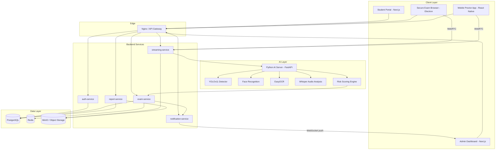
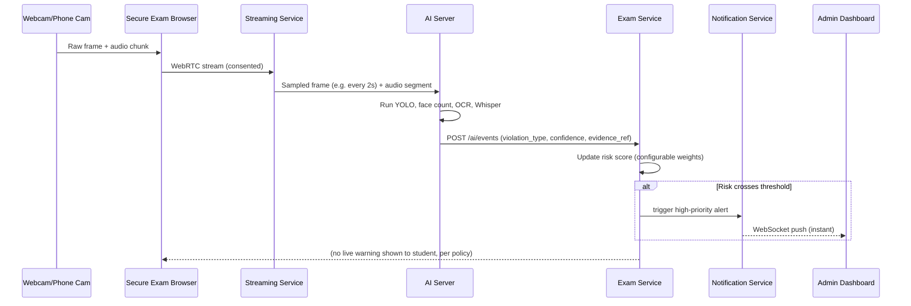
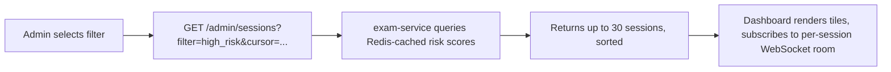
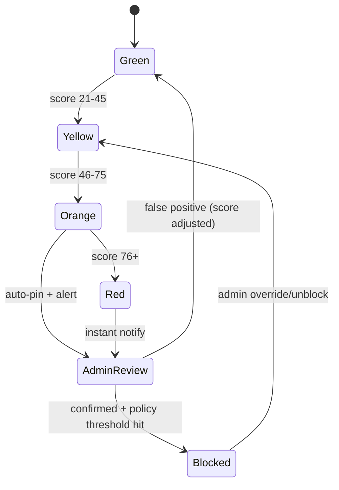
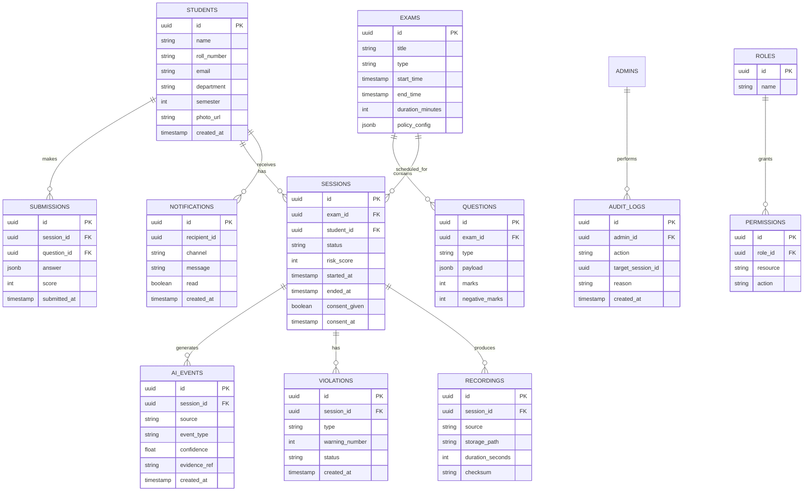

# DeveloperGuide.md
## Enterprise AI-Powered Online Examination & Proctoring Platform

**Version:** 1.0
**Audience:** Engineering teams (Backend, Frontend, Mobile, AI/ML, DevOps)
**Scope:** End-to-end architecture, folder structure, APIs, database, security, AI risk engine, deployment, and build order for a CodeTantra/Proctorio-class secure exam platform.

> **Important framing note (read first):** This guide assumes monitoring (camera, microphone, screen) is only ever activated **after the student has seen the exam's proctoring policy and given explicit consent** on a Consent Screen. This is not just an ethical preference — in most jurisdictions, recording someone's camera/mic/screen without disclosure is illegal. What *can* be hidden from the student is the **live moment-to-moment risk score and warning feed** (so students can't game detection), not the *fact that proctoring is happening at all*. Every section below is written with that distinction in mind.

---

## Table of Contents

1. [System Overview](#1-system-overview)
2. [High-Level Architecture](#2-high-level-architecture)
3. [Monorepo Folder Structure](#3-monorepo-folder-structure)
4. [Student Portal](#4-student-portal)
5. [Secure Desktop Exam Browser (Electron)](#5-secure-desktop-exam-browser-electron)
6. [Mobile Proctor App](#6-mobile-proctor-app)
7. [Admin Dashboard](#7-admin-dashboard)
8. [Node.js Backend](#8-nodejs-backend)
9. [Python AI Server](#9-python-ai-server)
10. [AI Risk Engine](#10-ai-risk-engine)
11. [Database Schema](#11-database-schema)
12. [API Documentation](#12-api-documentation)
13. [WebSocket & Streaming Architecture](#13-websocket--streaming-architecture)
14. [Security Guide](#14-security-guide)
15. [Consent & Privacy Workflow](#15-consent--privacy-workflow)
16. [Recording & Evidence Pipeline](#16-recording--evidence-pipeline)
17. [Reports & Analytics](#17-reports--analytics)
18. [DevOps & Deployment](#18-devops--deployment)
19. [Testing Strategy](#19-testing-strategy)
20. [Build Order (Phased Roadmap)](#20-build-order-phased-roadmap)
21. [Known Limitations (Read Before Promising Features)](#21-known-limitations)
22. [Production Checklist](#22-production-checklist)

---

## 1. System Overview

The platform lets an institution create exams (MCQ/MSQ/Subjective/Coding/Typing), have students take them inside a locked-down environment, and gives admins/proctors real-time visibility plus AI-assisted flagging of suspicious behavior, with human review before any disciplinary action.

**Core actors:**
- **Student** — takes exams via the Secure Exam Browser (desktop) and pairs a phone as a secondary camera.
- **Admin/Proctor** — creates exams, watches live monitoring grid, reviews AI alerts, takes action.
- **AI Server** — analyzes video/audio/screen signals and produces risk events, not verdicts.

**Design principles:**
- Consent-first monitoring (see [Section 15](#15-consent--privacy-workflow)).
- AI produces **signals with confidence scores**, never automatic guilt — except for narrowly-scoped, admin-configured automated policies (e.g., auto-submit after N confirmed clipboard violations), which admins can always override.
- Every automated action is logged and reversible by an admin.
- Full audit trail for every evidence artifact (hash-chained where possible).

---

## 2. High-Level Architecture



### Data flow for one proctoring event



---

## 3. Monorepo Folder Structure

```
exam-platform/
├── apps/
│   ├── student-portal/            # Next.js student-facing web app
│   ├── admin-dashboard/           # Next.js admin/proctor console
│   ├── secure-browser/            # Electron desktop exam client
│   └── mobile-proctor/            # React Native app (Android + iOS)
│
├── services/
│   ├── auth-service/              # Login, JWT, RBAC, sessions
│   ├── exam-service/              # Exams, questions, submissions, risk scoring
│   ├── ai-service/                # Python FastAPI: CV/audio inference
│   ├── streaming-service/         # WebRTC SFU signaling + recording ingest
│   ├── notification-service/      # WebSocket push, email, SMS
│   └── report-service/            # PDF/CSV generation, analytics rollups
│
├── packages/
│   ├── ui/                        # Shared React component library (Tailwind)
│   ├── shared/                    # Shared TS types, constants, zod schemas
│   ├── database/                  # Prisma schema + migrations, shared with services
│   └── sdk/                       # Typed API client used by all frontends
│
├── infrastructure/
│   ├── docker/                    # Dockerfiles per service
│   ├── kubernetes/                # Helm charts / manifests
│   └── nginx/                     # Reverse proxy + TLS termination config
│
├── docs/                          # This guide + ADRs + runbooks
├── scripts/                       # Bootstrap, seed, migration helper scripts
├── docker-compose.yml             # Local dev stack
└── turbo.json / nx.json           # Monorepo build orchestration
```

### Key file responsibilities (representative, not exhaustive)

| File | Responsibility |
|---|---|
| `services/auth-service/src/routes/auth.routes.ts` | Login/signup/refresh/logout endpoints |
| `services/auth-service/src/middleware/rbac.ts` | Role-based route guards (student/teacher/admin) |
| `services/exam-service/src/modules/risk/riskEngine.ts` | Applies configurable weights to incoming AI events |
| `services/exam-service/src/modules/exam/examStateMachine.ts` | Enforces exam lifecycle: not-started → in-progress → auto-submitted/submitted |
| `services/streaming-service/src/sfu/roomManager.ts` | Creates/destroys WebRTC rooms per exam session |
| `services/ai-service/app/pipelines/face_pipeline.py` | Face count + identity match against enrollment photo |
| `services/ai-service/app/pipelines/object_pipeline.py` | YOLO inference for phone/book/notes detection |
| `services/ai-service/app/pipelines/audio_pipeline.py` | Whisper transcription + voice-activity/second-speaker heuristics |
| `packages/database/prisma/schema.prisma` | Single source of truth for DB schema |
| `apps/secure-browser/src/main/kiosk.ts` | Fullscreen/kiosk enforcement, focus-loss detection |
| `apps/secure-browser/src/main/integrityChecks.ts` | Dev-tools detection, clipboard hooks, screenshot-attempt logging |
| `apps/mobile-proctor/src/screens/PairingScreen.tsx` | QR scan + secure token exchange with backend |
| `apps/admin-dashboard/src/features/monitoring/LiveGrid.tsx` | 30-tile virtualized live monitoring grid |

---

## 4. Student Portal

**Stack:** Next.js + TypeScript + Tailwind + Redux Toolkit + React Query + Socket.IO client.

### Pages / Flows
1. **Signup / Login** — email or institutional ID + password, OTP optional, JWT issued.
2. **Profile** — photo (used later for face-match enrollment), roll number, department, semester.
3. **Exam Dashboard** — Upcoming / Completed / In-progress exams.
4. **Exam Instructions Page** — rules, allowed materials, duration, negative marking policy.
5. **Consent Screen (mandatory gate)** — explicitly lists: camera will be recorded, microphone will be recorded, screen will be recorded, a secondary phone camera may be required, and that violations are reviewed by a human before any penalty. Requires explicit "I Agree" checkbox + timestamp logged. **Exam cannot start without this record.**
6. **Exam Launcher** — checks device: camera present, mic present, browser is the Secure Exam Browser (via a signed handshake token), optionally requires phone pairing.
7. **Exam Runtime Views**
   - MCQ/MSQ renderer
   - Subjective (rich text editor, autosave every 10s)
   - Coding (Monaco editor + language selector + run/submit against test cases)
   - Typing Test (WPM/accuracy calculation, prompt text)
8. **Result Page** — score, section-wise breakdown (release policy configurable by admin).
9. **AI Risk History** — a *post-exam* summary the student can see after grading (not live), listing what was reviewed and any confirmed violations — transparency without giving real-time gaming ability.
10. **Session History / Exam Logs** — device used, join/leave timestamps, connection quality.

### Accessibility & UX
- Dark mode via Tailwind `class` strategy.
- WCAG AA contrast, keyboard navigation for MCQ/typing views, screen-reader labels on timers and warnings.
- Responsive breakpoints: mobile mostly unused for actual exam-taking (locked to desktop for high-stakes exams), but profile/dashboard are responsive.

---

## 5. Secure Desktop Exam Browser (Electron)

This is the **student-facing locked-down client**. It is the main enforcement point for anti-cheating controls that are technically possible on a desktop OS.

### Feature matrix (be explicit about what's real)

| Feature | Enforceability | Notes |
|---|---|---|
| Fullscreen kiosk mode | ✅ Reliable | Electron `kiosk: true`, blocks Alt+F4/Alt+Tab where OS allows |
| Window focus / tab-away detection | ✅ Reliable (Electron app) | `browser-window-blur` event |
| Copy/paste blocking **inside app** | ✅ Reliable within the app's own text fields | Cannot block OS-level clipboard globally without a kernel-level agent |
| Screenshot **prevention** | ⚠️ Partial | Can block `PrintScreen` key inside app focus; cannot prevent a second physical device photographing the screen |
| Screenshot **attempt logging** | ⚠️ Partial | Can detect the key combo; OS screenshot tools vary (Snip & Sketch, macOS Cmd+Shift+4) — coverage differs per OS |
| Developer tools blocking | ✅ Reliable in packaged Electron build | `webContents.on('devtools-opened')` + disable via `webPreferences.devTools:false` in production build |
| Dual monitor detection | ✅ Reliable | `screen.getAllDisplays().length > 1` |
| Virtual machine / screen-recording software detection | ⚠️ Best-effort | Can check for known process names / driver signatures; not foolproof, sophisticated users can evade |
| Auto-submit on 3+ confirmed violations | ✅ Configurable policy | Implemented in exam-service state machine, not client-side only (client-side-only enforcement is trivially bypassed) |

### Runtime architecture

```
apps/secure-browser/
├── src/
│   ├── main/                     # Electron main process
│   │   ├── kiosk.ts              # Fullscreen + window management
│   │   ├── integrityChecks.ts    # devtools/copy-paste/focus-loss hooks
│   │   ├── autoUpdater.ts        # electron-updater config
│   │   ├── offlineCache.ts       # local SQLite/queue for answers when net drops
│   │   └── ipc/                  # IPC handlers bridging renderer <-> main
│   ├── renderer/                 # The actual exam UI (React), sandboxed
│   │   ├── views/ExamRuntime.tsx
│   │   ├── views/CodingIDE.tsx   # Monaco wrapper
│   │   └── views/TypingTest.tsx
│   └── preload/                  # contextBridge-exposed safe APIs only
├── forge.config.ts               # Electron Forge packaging config
└── package.json
```

### Session & offline handling
- **Heartbeat**: renderer pings `exam-service` every 5s over WebSocket; main process buffers unsent heartbeats if offline.
- **Offline recovery**: answers saved to local encrypted SQLite; on reconnect, diff-synced to server; server is authoritative on conflict (last-write-wins per question, timestamped).
- **Auto-submit-on-disconnect policy**: configurable grace period (e.g., 2 minutes) before auto-submit, to avoid punishing students for real network drops.
- **Exam Lock Workflow**: signed short-lived token issued at exam start; browser refuses to render exam content if the token is missing/expired/tampered (checked via HMAC, not just presence).

---

## 6. Mobile Proctor App

**Stack:** React Native (shared codebase, Android + iOS).

### Flow
1. Student opens Secure Exam Browser → clicks "Pair Phone."
2. Backend issues a short-lived QR payload (`{examSessionId, pairingToken}` signed, 60s expiry).
3. Student scans with the Mobile Proctor App (or a mobile web fallback).
4. App requests camera + microphone permission **with an explicit rationale screen** (Android runtime permission / iOS `NSCameraUsageDescription`).
5. On grant, app opens a WebRTC connection to `streaming-service`, tagged as `role: secondary-camera`.
6. Student is instructed (in-app) to place the phone at ~45° so face, keyboard, and desk are visible.

### Capabilities
- Rear camera streaming (primary; front+rear simultaneous streaming is **not reliably supported** cross-platform — see [Limitations](#21-known-limitations)).
- Camera occlusion / blur / low-light detection done in `ai-service`, not on-device, to keep the phone app lightweight.
- Battery + network quality reported every 15s (`battery-status`, `NetInfo`).
- Tamper detection: app monitors for camera-permission revocation, app backgrounding, and stream drop; reports state changes immediately.
- Auto-reconnect with exponential backoff (1s, 2s, 4s… capped at 30s).
- Background recovery: Android foreground service keeps the stream alive when screen locks (with a persistent notification, since Android requires visible notification for foreground camera use — this is also a transparency feature, not a bug).

```
apps/mobile-proctor/
├── src/
│   ├── screens/
│   │   ├── PairingScreen.tsx
│   │   ├── PermissionRationaleScreen.tsx
│   │   ├── LiveMonitorScreen.tsx     # shows local preview + connection status
│   │   └── DisconnectedScreen.tsx
│   ├── services/
│   │   ├── webrtcClient.ts
│   │   ├── deviceHealth.ts          # battery/network polling
│   │   └── secureStorage.ts         # token storage (Keychain/Keystore)
│   └── navigation/
├── android/
├── ios/
└── app.json
```

---

## 7. Admin Dashboard

**Stack:** Next.js + TypeScript + Tailwind + React Query + Socket.IO client.

### Pages
Overview · Exam Monitoring · Student Monitoring · AI Alerts · Risk Heatmap · Exam Control · Question Management · Exam Scheduling · Student Management · Teacher Management · Reports · Analytics · Audit Logs · Role Management · Settings · Notifications · Live Sessions.

### Live Monitoring Page (core screen)

- Grid of up to **30 students per page**, virtualized (`react-window` or `TanStack Virtual`) so off-screen tiles don't render video decoders.
- Each tile: low-res thumbnail (e.g. 320×180 @ 2–5 fps) pulled from `streaming-service`'s transcoded preview track, plus name, roll number, current risk score, and status chip.
- Clicking a tile **requests a high-quality stream** for that student only (signals `streaming-service` to bump that peer's simulcast layer or renegotiate a full-res track) — this is what keeps bandwidth sane at scale.
- **AI-flagged (high-risk) students auto-pin to the top** of the grid, sorted by risk score descending.
- **Filters**: High Risk, Phone Detected, Multiple Faces, Warnings ≥ N, custom event type.
- **Pagination**: server-driven cursor pagination over active sessions; page size fixed at 30.



### Exam Control
- Admin uploads question bank (CSV/JSON import, or manual builder with rich text + code templates + test cases).
- Slot booking / scheduling: exam window, allowed late-join grace period, section timers, global timer, shuffle toggle, negative marking config.
- **Live control actions**: force-submit a student, extend time for a student, unblock a blocked student, send a targeted message, terminate a session.
- Every control action is written to `audit_logs` with `admin_id`, `action`, `target_session_id`, `timestamp`, `reason` (required free-text field).

### Warnings / Auto-block policy (as configured per your requirements)
- Configurable violation types trigger a **warning** shown to the student in-exam (e.g., "Copying text is not permitted — Warning 1/3").
- On the **4th** confirmed attempt (i.e., after 3 warnings), the system:
  1. Auto-submits the exam.
  2. Marks the session `blocked`.
  3. Sends an instant high-priority notification to the admin.
- **Admin retains override authority**: a dedicated "Unblock & Resume" action exists, which re-opens the session for a configurable extra time window and logs the override with a mandatory justification note.

---

## 8. Node.js Backend

**Stack:** Node.js + Express + TypeScript + Socket.IO + Redis + BullMQ + JWT + RBAC.

### Service breakdown

| Service | Responsibility |
|---|---|
| `auth-service` | Signup/login, JWT issuance + refresh, RBAC middleware, password reset, session revocation |
| `exam-service` | Exam CRUD, question bank, submission handling, exam state machine, risk score aggregation, warning/auto-submit policy |
| `streaming-service` | WebRTC signaling (SFU via mediasoup/LiveKit), stream key issuance, recording ingest triggers |
| `notification-service` | WebSocket push to admin dashboard, email (SES/SendGrid), SMS (optional, Twilio) |
| `report-service` | Aggregates data into PDF/CSV reports, scheduled analytics rollups (BullMQ cron jobs) |

### Cross-cutting concerns
- **RBAC**: roles `student`, `teacher`, `admin`, `super_admin`, each with a permission set stored in `roles`/`permissions` tables, checked via middleware on every route.
- **Rate limiting**: `express-rate-limit` + Redis store, tuned per-route (login stricter than read-only GETs).
- **Job queue (BullMQ + Redis)**: video chunk processing, report generation, email/SMS dispatch, AI event batching.
- **WebSocket rooms**: one Socket.IO room per `examSessionId`; admin dashboard subscribes to a `admin:{examId}` room that fans out session summaries.

---

## 9. Python AI Server

**Stack:** FastAPI + PyTorch + ONNX Runtime + OpenCV + YOLOv11 + Whisper + EasyOCR + MediaPipe + face_recognition + scikit-learn.

```
services/ai-service/
├── app/
│   ├── main.py                     # FastAPI app entrypoint
│   ├── pipelines/
│   │   ├── face_pipeline.py        # face count, identity match vs enrollment photo
│   │   ├── object_pipeline.py      # YOLOv11: phone, book, notes, earbuds, second person
│   │   ├── pose_pipeline.py        # MediaPipe: looking-away / gaze heuristic
│   │   ├── ocr_pipeline.py         # EasyOCR: on-screen text -> flag search engines/chat UIs
│   │   └── audio_pipeline.py       # Whisper transcription, voice-activity, second-speaker heuristic
│   ├── risk/
│   │   └── event_emitter.py        # normalizes pipeline outputs into AIEvent schema, posts to exam-service
│   ├── models/                     # ONNX/PyTorch weight files (not committed to git — pulled from object storage at build time)
│   └── workers/
│       └── frame_sampler.py        # pulls sampled frames/audio chunks from streaming-service
├── requirements.txt
└── Dockerfile
```

### Inference cadence (bandwidth/CPU-aware defaults)
- Screen + webcam frames sampled every **2 seconds** for object/face pipelines (configurable).
- Audio processed in **10-second rolling windows** for Whisper (batching avoids per-frame GPU thrash).
- OCR runs on **screen frames only**, every 5 seconds (cheaper cadence — OCR is expensive).

### Every pipeline outputs a normalized `AIEvent`:
```json
{
  "session_id": "uuid",
  "source": "webcam | phone_cam | screen | audio",
  "event_type": "MULTIPLE_FACES | PHONE_DETECTED | FACE_MISSING | LOOKING_AWAY | UNAUTHORIZED_APP_TEXT | SECOND_VOICE",
  "confidence": 0.87,
  "evidence_ref": "s3://evidence-bucket/session/frame_00123.jpg",
  "timestamp": "2026-07-17T10:15:32Z"
}
```
`exam-service` is the only consumer that turns these into risk-score deltas — the AI server never makes a pass/fail or block decision itself.

---

## 10. AI Risk Engine

A **configurable scoring framework**, not an autonomous disciplinary system.

### Example event weights (institution-configurable)

| Event | Default Points |
|---|---|
| Multiple faces detected | +15 |
| Face missing > 10s | +10 |
| Looking away (confidence > 0.7) | +5 |
| Camera blocked/covered | +12 |
| Phone detected | +20 |
| Book/notes detected | +15 |
| Second voice / coaching audio cues | +25 |
| Repeated focus loss from exam window | +8 (per occurrence, capped) |
| Clipboard/copy attempt | +10 (warning issued at this tier) |
| Long inactivity (> 3 min) | +5 |

### Risk levels
| Level | Score Range | Dashboard Color |
|---|---|---|
| Green | 0–20 | Normal |
| Yellow | 21–45 | Watch |
| Orange | 46–75 | High priority, auto-pinned |
| Red | 76+ | Top of grid, instant admin notification |

### Human-in-the-loop review
Every Orange/Red transition opens an **Evidence Card** in the admin dashboard: the triggering frame/audio clip, timestamp, confidence, and a timeline of prior events for that student. Admins mark each as `Confirmed Violation`, `False Positive`, or `Needs More Review` — this feedback loop is also logged and can later be used to retrain/tune thresholds.



---

## 11. Database Schema

Core tables (PostgreSQL). Full Prisma schema lives in `packages/database/prisma/schema.prisma`.



---

## 12. API Documentation

Base URL: `https://api.examplatform.com/v1`

### Auth
```
POST /auth/signup
Body: { "name", "email", "password", "role": "student" }
201 -> { "userId", "token", "refreshToken" }

POST /auth/login
Body: { "email", "password" }
200 -> { "token", "refreshToken", "role" }
```

### Exams
```
GET /exams?status=upcoming
200 -> [{ "id", "title", "startTime", "durationMinutes" }]

POST /exams                     (admin, RBAC-protected)
Body: { "title", "type", "startTime", "durationMinutes", "policyConfig" }
201 -> { "id" }
```

### Sessions
```
POST /sessions/start
Body: { "examId", "consentGiven": true }
200 -> { "sessionId", "wsToken" }

POST /sessions/{id}/heartbeat
200 -> { "ack": true }
```

### AI Events (internal, called by ai-service)
```
POST /ai/events
Body: { "sessionId", "source", "eventType", "confidence", "evidenceRef" }
202 -> { "riskScore": 63, "riskLevel": "orange" }
```

### Admin monitoring
```
GET /admin/sessions?filter=high_risk&cursor=...
200 -> { "sessions": [...30 max...], "nextCursor": "..." }

POST /admin/sessions/{id}/unblock
Body: { "reason": "Verified false positive via evidence review" }
200 -> { "status": "resumed" }
```

### Reports
```
GET /reports/exam/{examId}?format=pdf
200 -> binary PDF stream
```

All list endpoints use cursor-based pagination; all mutating endpoints require a JWT with the appropriate RBAC permission and are logged to `audit_logs`.

---

## 13. WebSocket & Streaming Architecture

- **Signaling**: Socket.IO namespace `/signaling` handles WebRTC offer/answer/ICE exchange between clients and the SFU (mediasoup or LiveKit recommended over a plain P2P mesh — P2P doesn't scale past a handful of peers per room).
- **Simulcast**: each webcam/phone stream publishes multiple quality layers; the admin dashboard subscribes to the low layer by default for all tiles, and requests the high layer only for the currently-selected student (bandwidth optimization requirement).
- **Recording ingest**: SFU forwards a copy of each track to a recording worker that chunks to MinIO in ~10s segments (for resumability and faster evidence seeking).

---

## 14. Security Guide

- **Transport**: TLS 1.2+ everywhere; HSTS enabled at Nginx.
- **AuthN/AuthZ**: short-lived JWT access tokens (~15 min) + rotating refresh tokens; RBAC middleware on every service route.
- **Secrets**: managed via a vault (e.g., Doppler/Vault/K8s Secrets), never committed; `.env.example` only in repo.
- **Input validation**: zod schemas shared from `packages/shared` validate every request body server-side (never trust client-side validation alone).
- **Standard web hardening**: Helmet headers, strict CORS allow-list, CSRF tokens on state-changing form posts from the browser context, parameterized queries via Prisma (SQL-injection safe by default), output encoding/sanitization for any user-generated rich text (subjective answers) to prevent stored XSS.
- **Signed URLs**: all evidence/recording downloads use short-lived signed URLs against MinIO, never public buckets.
- **Evidence integrity**: each recording chunk stored with a SHA-256 checksum recorded in `recordings.checksum`; a periodic job re-verifies checksums to detect tampering.
- **Data retention**: configurable retention window per institution policy (e.g., 90 days), after which recordings are purged automatically; retention policy must be disclosed on the Consent Screen.
- **Honesty about limits**: this system cannot guarantee a student has zero access to a second, unmonitored device, cannot reliably block all OS-level screenshot tools, and cannot fully prevent someone from photographing the screen with an external camera. Document this candidly in onboarding materials rather than making absolute claims.

---

## 15. Consent & Privacy Workflow

This is a **required gate**, not an optional nicety:

1. Before any exam that uses proctoring, the student sees a **Privacy & Proctoring Notice** stating exactly what will be recorded (webcam, mic, screen, optionally phone camera), how long recordings are kept, who can view them (admins/proctors, and possibly the student themself post-exam), and the consequences of confirmed violations.
2. The student must actively check "I have read and consent" — this timestamp and IP are stored in `sessions.consent_given` / `consent_at`.
3. **If consent is not given, the exam does not start** — there is no "silent monitoring" fallback. Institutions that need monitoring must build it into the terms students agree to when registering for the course/exam, not sneak it past them technically.
4. What *is* legitimately kept from the student in real time: the live numeric risk score and the specific AI alerts firing on the admin side. This is standard for anti-cheating systems (like fraud-detection systems not showing a suspect their fraud score) and is different from hiding the *existence* of monitoring.
5. Students receive a post-exam summary of any confirmed violations (from the Evidence Card review), preserving fairness and a right to appeal.

---

## 16. Recording & Evidence Pipeline

- Screen, webcam, and phone-camera streams recorded in parallel, chunked (~10s), uploaded to MinIO with server-side encryption at rest.
- A **Timeline Generator** service stitches AI events + violation markers onto a scrubbable timeline in the admin evidence viewer, so a proctor can jump straight to the flagged moment instead of watching a full 2-hour recording.
- **Evidence Export**: a bundle (video clip + transcript + AI event metadata + checksum) can be exported as a signed, timestamped zip for academic-integrity hearings.
- Retention policy enforced by a scheduled job (`report-service` cron) that purges recordings past the configured window and logs the purge in `audit_logs`.

---

## 17. Reports & Analytics

Report types: Student Report, Exam Report, Violation Report, Risk Report, Admin Report, Analytics Report, Attendance Report — each exportable as PDF (via a headless-Chromium/Puppeteer template render) or CSV (raw tabular).

Analytics Dashboard surfaces: average risk score per exam, violation-type frequency histograms, pass/fail distributions, and proctor response-time metrics (time from alert to admin action) — useful for tuning risk weights over time.

---

## 18. DevOps & Deployment

- **Local dev**: `docker-compose.yml` spins up Postgres, Redis, MinIO, and all services with hot-reload.
- **Containerization**: one Dockerfile per service under `infrastructure/docker/`.
- **Orchestration**: Kubernetes manifests (or Helm charts) per service, with HPA (Horizontal Pod Autoscaler) tuned on CPU/GPU for `ai-service` and connection count for `streaming-service`.
- **Reverse proxy/TLS**: Nginx ingress controller, cert-manager for automated TLS renewal.
- **CI/CD**: GitHub Actions — lint/test on PR, build+push images on merge to `main`, deploy via `kubectl apply`/Helm upgrade on tag.
- **Observability**: Prometheus for metrics, Grafana dashboards (risk-engine throughput, WebRTC connection health, queue depth), Loki for centralized logs.
- **Scaling notes**: `ai-service` should run on GPU-backed nodes; scale horizontally by session count, with a queue (BullMQ) buffering frame-analysis jobs so bursts don't drop frames.
- **Backups**: nightly PostgreSQL logical backups + WAL archiving for point-in-time recovery; MinIO bucket versioning for evidence integrity.
- **Disaster recovery**: documented RTO/RPO targets, regular restore drills, multi-AZ Postgres replica for failover.

---

## 19. Testing Strategy

- **Unit tests**: Jest (Node services), PyTest (AI service).
- **Integration tests**: spin up docker-compose stack in CI, run Supertest against real endpoints.
- **AI validation**: a labeled test dataset (frames known to contain phones/multiple faces/etc.) run through pipelines to track precision/recall over model updates — never ship a model change without rerunning this suite.
- **Load testing**: k6/Locust simulating N concurrent exam sessions + WebRTC streams to validate the 30-student monitoring page holds up.
- **Security testing**: dependency scanning (Snyk/Dependabot), OWASP ZAP scan against staging, periodic third-party pen test before major releases.
- **UAT**: a pilot cohort of real students/proctors runs a mock exam before go-live.
- **Regression testing**: full E2E suite (Playwright) covering signup → consent → exam → violation → auto-submit → admin review, run on every release candidate.

---

## 20. Build Order (Phased Roadmap)

| Phase | Deliverable |
|---|---|
| 1 | Auth service, database schema, core backend skeleton |
| 2 | Student Portal (dashboard, exam runtime, consent flow) |
| 3 | Secure Exam Browser (Electron) — kiosk mode, MCQ/coding/typing runtime |
| 4 | Mobile Proctor App — pairing, camera streaming |
| 5 | AI Server — face/object/OCR/audio pipelines, event emission |
| 6 | Streaming service — WebRTC SFU, recording ingest |
| 7 | Admin Dashboard — live monitoring grid, AI alerts, exam control |
| 8 | Reports & analytics service |
| 9 | DevOps — Docker/K8s/CI-CD/monitoring stack |
| 10 | Hardening, pilot UAT, production launch |

---

## 21. Known Limitations

Be upfront about these with stakeholders — do not market them as solved:

- Cannot guarantee detection of a second, completely separate unmonitored device used off-camera.
- Cannot reliably block every OS-level screenshot/screen-recording tool across Windows/macOS/Linux — coverage is best-effort and varies by OS.
- Simultaneous front+rear camera streaming on a phone is not reliably supported across all Android/iOS devices; production deployments should plan around rear-camera-only.
- AI detections (face count, object detection, audio cues) are probabilistic; false positives/negatives will occur, especially with poor lighting or accents/background noise — hence the mandatory human evidence review step.
- Kiosk-mode enforcement is strongest on managed/institution-owned devices with MDM; on unmanaged personal devices, some OS-level bypasses (VMs, external capture cards) cannot be fully prevented by application-layer software alone.

---

## 22. Production Checklist

- [ ] Consent Screen live and blocking exam start without recorded consent
- [ ] TLS certificates valid and auto-renewing
- [ ] RBAC verified for all admin/teacher/student routes
- [ ] Rate limiting active on auth endpoints
- [ ] Evidence storage encrypted at rest, signed URLs only
- [ ] Retention/purge job scheduled and tested
- [ ] Risk-engine weights reviewed and approved by the institution's academic-integrity office
- [ ] Admin override (unblock) flow tested end-to-end
- [ ] Load test passed at target concurrent session count
- [ ] Backup + restore drill completed
- [ ] Monitoring dashboards (Grafana) and alerting configured
- [ ] Legal/privacy review of proctoring notice completed for target jurisdiction(s)

---

*End of DeveloperGuide.md*
