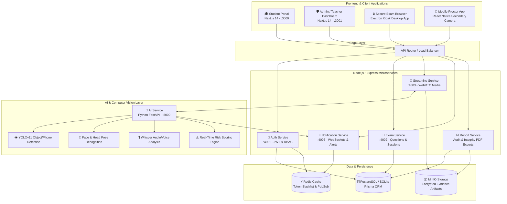

<div align="center">
  
  
  # ExamGuard — AI-Powered Secure Examination & Proctoring Platform
  
  **An Enterprise-Grade, Multi-Modal AI Proctoring & Assessment Suite**  
  Built with **Next.js 14**, **Electron**, **React Native**, **Node.js/Express Microservices**, **Python (FastAPI + YOLOv11)**, and **Prisma ORM**.

  [](https://nextjs.org/)
  [](https://www.typescriptlang.org/)
  [](https://nodejs.org/)
  [](https://fastapi.tiangolo.com/)
  [](https://www.prisma.io/)
  [](https://turbo.build/)
  [](LICENSE)
</div>

---

## 🌟 Overview

**ExamGuard** is a next-generation online examination and proctoring ecosystem designed for universities, certification bodies, and enterprises. It provides end-to-end exam lifecycle management (MCQ, MSQ, Subjective, Coding, and Typing assessments) combined with **multi-modal AI behavior monitoring** and **consent-first privacy enforcement**.

Unlike traditional black-box proctoring tools, ExamGuard produces **real-time risk signals with confidence scores** (via YOLOv11 object detection, facial recognition, head pose tracking, and Whisper audio analysis) while keeping human proctors in full control before any disciplinary action is taken.

---

## 🏗️ High-Level Architecture



---

## 📦 Monorepo Structure

ExamGuard is organized as a high-performance **Turborepo** monorepo:

```text
├── apps/
│   ├── student-portal/     # Next.js 14 student examination portal (Port 3000)
│   ├── admin-dashboard/    # Next.js 14 live proctoring grid & exam management (Port 3001)
│   ├── secure-browser/     # Electron locked-down desktop exam browser with kiosk mode
│   └── mobile-proctor/     # React Native mobile app for 360° secondary camera pairing
│
├── services/
│   ├── auth-service/       # Express microservice for authentication, JWTs, RBAC & Firebase OAuth (Port 4001)
│   ├── exam-service/       # Express microservice for question banks, exam policies & submissions (Port 4002)
│   ├── streaming-service/  # WebRTC signaling and media stream ingestion (Port 4003)
│   ├── notification-service/ # WebSocket live warning feeds & proctor broadcasts (Port 4005)
│   ├── report-service/     # Audit trails, integrity scoring, and automated PDF report generation
│   └── ai-service/         # Python FastAPI computer vision & audio analysis pipeline (Port 8000)
│
├── packages/
│   ├── database/           # Prisma ORM schema, migrations, and automated seeders
│   └── shared/             # TypeScript interfaces, Zod validation schemas, and core enums
│
└── DeveloperGuide.md       # Complete 37,000+ word engineering specification and architecture guide
```

---

## ✨ Key Features

### 🛡️ For Proctors & Administrators
- **Live Proctoring Grid**: Monitor dozens of active student camera feeds simultaneously with instant AI anomaly badges.
- **AI-Assisted Violation Feed**: Real-time alerts for missing faces, multiple faces, mobile phones, books/notes, clipboard copying, and background speech.
- **Dynamic Policy Configuration**: Customize required hardware (webcam, mic, screen share, mobile secondary camera), negative marking fractions, and automated warning thresholds.
- **Interactive Exam & Question Bank Builder**: Support for MCQs, MSQs, Subjective essays with word counters, and multi-language Coding assignments with automated test runners.
- **Complete Evidence Audit Trail**: Hash-chained audit records, timeline scrubbing, and PDF integrity reports.

### 🎓 For Students
- **Consent-First Privacy**: Clear disclosure screens and explicit consent workflows before any camera or screen recording begins.
- **Seamless Unified Sign-In**: Login via standard email/password or **Firebase Google OAuth** with automatic role synchronization.
- **Robust Exam Environment**: Auto-saving answers, network disconnection recovery, and an intuitive distraction-free interface.
- **Mobile Proctor Pairing**: Scan a secure QR code to pair a secondary phone camera for comprehensive room verification.

---

## 🚀 Quickstart Guide

### 1. Prerequisites
- **Node.js**: `>= 20.0.0`
- **npm**: `>= 10.0.0`
- **Python**: `>= 3.10` (if running the local AI Service directly)

### 2. Installation
Clone the repository and install all dependencies across all workspaces:

```bash
git clone https://github.com/avinash9354/AI-Proctor-Exam-Platform.git
cd AI-Proctor-Exam-Platform
npm install
```

### 3. Environment Setup
Create local environment files or use the default local configuration:

```bash
cp .env.example .env
cp apps/student-portal/.env.local.example apps/student-portal/.env.local
```

### 4. Database Setup & Seeding
Generate the Prisma client, run database migrations, and populate the database with demo users and sample exams:

```bash
npm run db:generate
npm run db:seed
```

### 5. Launch Development Servers
Start all frontend portals and backend microservices concurrently using Turborepo:

```bash
npm run dev
```

| Application / Service | URL / Port | Description |
| :--- | :--- | :--- |
| **Student Portal** | [http://localhost:3000](http://localhost:3000) | Student login & examination dashboard |
| **Admin Dashboard** | [http://localhost:3001](http://localhost:3001) | Live proctoring grid & exam setup |
| **Auth Service** | `http://localhost:4001` | Authentication & User RBAC API |
| **Exam Service** | `http://localhost:4002` | Questions & Submissions API |
| **Notification Service** | `http://localhost:4005` | Live WebSockets & Alerts |
| **AI Service (Python)** | `http://localhost:8000` | Computer Vision & Risk Engine |

---

## 🔑 Demo Credentials

After running `npm run db:seed`, you can immediately sign in using any of these pre-configured accounts:

| Role | Email | Password | Access Area |
| :--- | :--- | :--- | :--- |
| **Platform Admin** | `admin@examplatform.com` | `Admin@1234` | Admin Dashboard (`:3001`) |
| **Teacher / Proctor** | `teacher@examplatform.com` | `Teacher@1234` | Admin Dashboard (`:3001`) |
| **Student 1** | `student1@examplatform.com` | `Student@1234` | Student Portal (`:3000`) |
| **Student 2** | `student2@examplatform.com` | `Student@1234` | Student Portal (`:3000`) |

> **💡 Tip (Google Sign-In):** You can also click **Sign in with Google (Firebase)** on either the Student or Admin tab. The backend will automatically synchronize your role depending on the tab you select during sign-in!

---

## 🛠️ Available Scripts

- `npm run dev` — Starts all frontend applications and backend microservices in parallel.
- `npm run build` — Builds all packages and apps for production.
- `npm run lint` — Runs ESLint checks across all workspaces.
- `npm run type-check` — Runs TypeScript compiler verification across all workspaces.
- `npm run db:generate` — Generates Prisma Client for the database package.
- `npm run db:migrate` — Applies database migrations.
- `npm run db:seed` — Populates the database with roles, users, exams, and questions.
- `npm run db:studio` — Opens Prisma Studio UI (`http://localhost:5555`) to visually browse database rows.

---

## 📖 Comprehensive Engineering Documentation

For a deep-dive into the technical architecture, AI risk scoring algorithms, WebSocket payloads, database schemas, and production deployment checklists, consult the exhaustive developer specification:

👉 **[Read the full Developer Guide (DeveloperGuide.md)](DeveloperGuide.md)**

---

## 🔒 Security & Privacy Policy

ExamGuard enforces strict ethical proctoring guidelines:
- **No Covert Surveillance**: Monitoring only occurs during an active exam session after explicit student opt-in.
- **AI Signal vs. Human Verdict**: AI detection flags events (`MULTIPLE_FACES`, `PHONE_DETECTED`, `AUDIO_VOICE`), but human proctors retain ultimate decision-making authority.
- **Data Retention & Expiry**: Exam video and audio recordings follow strict retention policies with automated purge workflows.

---

## 📄 License

This project is licensed under the **MIT License**. See the [LICENSE](LICENSE) file for details.
